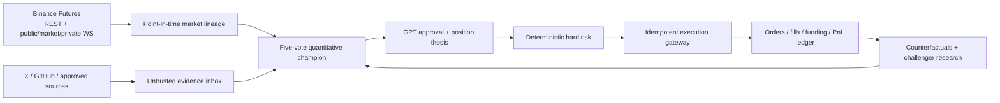

<div align="center">

# OpenTrader — GPT-Governed Binance Futures

### An auditable, fail-closed trading stack where AI can say **no**, but can never bypass risk.

[](#verification)
[](pyproject.toml)
[](https://developers.binance.com/en/docs/products/derivatives-trading-usds-futures/Introduction)
[](LICENSE)

**[English](#why-opentrader) · [中文](#中文简介) · [Architecture](docs/crypto-architecture.md) · [Runbook](docs/crypto-runbook.md) · [Roadmap](docs/roadmap.md)**

> ⭐ If you want AI trading systems to be testable, traceable, and unable to silently gamble with your account, star the repository and help harden it.

</div>

---

## Why OpenTrader?

Most “AI trading bots” let a language model improvise a trade and hope for the best. OpenTrader takes the opposite approach:

- deterministic signals create a short-lived, risk-bounded candidate;
- GPT may approve, reduce, hold, close, or reject it;
- hard-coded risk rules retain the final veto;
- every source, feature, decision, order, fill, thesis revision, and outcome is append-only and traceable;
- model failure closes new risk instead of opening it.

The result is not a magic profit machine. It is serious infrastructure for researching whether an AI-assisted strategy deserves capital.

## What makes it different

| Capability | OpenTrader behavior |
|---|---|
| GPT approval | Strict `OPEN / ADD / HOLD / REDUCE / CLOSE / REJECT` schema |
| Model authority | Can shrink or reject; cannot reverse direction, increase maximum size, or call Binance |
| Strategy | Five-vote 1h/4h momentum + Donchian champion with EWMA volatility sizing |
| Position memory | Append-only thesis, evidence for/against, invalidation conditions, PnL/R, review history |
| Learning | Champion/challenger research with counterfactuals, calibration, DSR/PBO and paired-shadow gates |
| Execution | Idempotent client IDs, protected limit entry, algo stop, REST + private-stream reconciliation |
| Failure mode | Timeouts, malformed JSON, stale streams, unknown orders, or missing evidence fail closed |
| Deployment | PostgreSQL fact store, Redis Streams, FastAPI control plane, isolated Docker services |

## Architecture



Binance's current stream split is implemented explicitly:

- `/public`: book ticker and depth;
- `/market`: mark price, closed 1h/4h candles, liquidation events;
- `/private`: listenKey account, order, fill, `ALGO_UPDATE`, and trigger-rejection events.

## GPT without handing over the keys

OpenTrader uses the OpenAI Responses API with strict structured output. The configured model roles are:

- `gpt-5.6-luna`: high-frequency evidence extraction;
- `gpt-5.6-terra`: 15-minute trade and position review;
- `gpt-5.6-sol`: deep daily/weekly strategy research.

These identifiers are configurable and must pass an exact-model capability probe in your OpenAI project. The system never silently substitutes a model. Web search, when enabled, is read-only and domain-allowlisted. OpenAI processes receive no Binance secret and have no order tool.

## Hard risk that GPT cannot edit

- isolated margin, one-way mode, leverage capped at 3×;
- initial risk ≤ 0.75% of equity, one profitable add ≤ 0.25%;
- no averaging down, no direct signal reversal, no unprotected position;
- gross ≤ 3×, net ≤ 1.5×, per-symbol ≤ 0.5×, correlation cluster ≤ 1×;
- daily loss at 3% freezes new risk; 20% peak drawdown flattens and permanently locks live trading;
- timeout/5xx/duplicate-ID orders are reconciled before any retry;
- strategy promotion never unlocks a larger capital stage.

## Quick start — safe paper mode

```bash
cp .env.example .env
docker compose config --quiet
docker compose --profile paper up -d --build trader-paper-api trader-paper-worker
curl --fail http://127.0.0.1:8000/health
```

Paper mode clears Binance, X, GitHub, and unrelated data credentials. Only the single paper worker can write execution state. Its stop monitor is a one-second sampled simulation—not an exchange-guaranteed stop.

For local development on Windows:

```powershell
python -m venv .venv
.\.venv\Scripts\python.exe -m pip install -e ".[dev,trader]"
.\.venv\Scripts\python.exe -m pytest -q
.\.venv\Scripts\python.exe -m ruff check src tests
```

See the [deployment and incident runbook](docs/crypto-runbook.md) before connecting any Demo credential.

## Controlled learning, not autonomous self-modification

GPT does not rewrite the executor or risk engine. It may propose a restricted `StrategySpec` containing only approved windows, thresholds, risk scaling, and prompt versions. A challenger must survive walk-forward testing, a sealed final 12 months, parameter perturbation, latency/social placebos, 2×/3× cost stress, and at least 90 paired-shadow days with 30 closed trades per side.

Promotion from backtest to paper, Demo, 10%, 25%, and 100% capital still requires human unlocks. Missing evidence fails closed.

## Verification

```text
380 tests passed
Ruff: all checks passed
Compose credential/network isolation: static checks passed
Live trading: locked by default
```

The suite covers signing and clock sync, exchange filters, sizing, GPT schemas, prompt injection, duplicate/out-of-order streams, expired listenKeys, partial fills, 429/418, 503 unknown states, algo-order rejection, reconciliation, funding, drawdown breakers, and recovery.

## Current limits

This repository is ready for local research, continuous paper operation, and supervised Binance Demo integration. It does **not** include licensed full-depth historical data, a built-in point-in-time exchange simulator, proven 90-day shadow results, or evidence of positive expected return. See the honest [implementation roadmap](docs/roadmap.md).

Never enable live trading before jurisdiction, exchange permissions, IP allowlists, credential isolation, real Demo failure drills, model availability, and research evidence are independently verified.

## 中文简介

OpenTrader 是一个 **GPT 审批型 Binance U 本位永续合约研究与执行框架**。量化策略先生成带方向、数量和风险上限的候选单，GPT 只能批准、缩小、拒绝或管理已有仓位，最终下单权始终属于确定性风控。

它支持完整持仓论点、证据谱系、订单/成交/funding 对账、反事实收益、受限策略研究和 champion/challenger 晋升。模型超时、证据不足、行情陈旧、订单状态未知或 JSON 异常时，系统禁止新增风险。默认只允许 paper；实盘需要多重静态开关和认证人工解锁。

如果你认同“AI 可以参与判断，但不能拥有无限交易权限”，欢迎 ⭐、提交 issue、补充回放场景或改进连接器。

## Companion project

The repository also preserves an isolated Windows A-share evidence and thesis tracker. It does not share trading credentials, databases, containers, or capital permissions with OpenTrader. See [Company Event Monitor](docs/company-event-monitor.md).

## Contributing and security

- Read [CONTRIBUTING.md](CONTRIBUTING.md) before opening a pull request.
- Report vulnerabilities through [SECURITY.md](SECURITY.md), not a public issue.
- Never submit real API keys, trading records, licensed datasets, or claims of profitability without reproducible evidence.

## License

MIT. See [LICENSE](LICENSE).

> **Risk warning:** derivatives trading can lose all posted collateral and more through fees, slippage, funding, and liquidation. This software is research infrastructure, not investment advice, a managed service, or a promise of profit.
