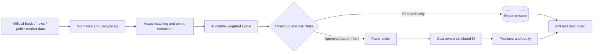

# Legacy A-share architecture

This diagram describes the retained `company_event_monitor` research module. It is isolated from
the futures runtime and does not participate in Binance approvals, account state, or order routing.
Its extractor uses the same principle as the trading system: typed outputs never receive execution
authority, while scoring and evidence storage remain independently testable.

The legacy desktop runtime remains local and SQLite-backed. Its API and dashboard are available only
through the Compose `company` profile. The implemented USDⓈ-M futures system uses separate
PostgreSQL/Redis-backed API, trading-worker, and intelligence-worker boundaries; see
[crypto-architecture.md](crypto-architecture.md).
