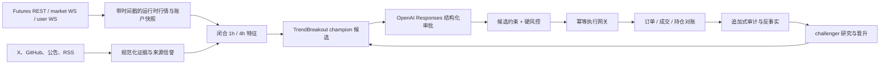

# GPT 审批型 USDⓈ-M Futures 架构

## 设计目标与边界

该子系统把“生成交易候选”“语言模型审批”“不可绕过的硬风控”和“交易所执行”拆成独立边界。语言模型可以拒绝、缩小或管理已有仓位，但不能访问 Binance 密钥、直接调用下单工具、反向开仓或扩大候选单的风险上限。

这不是收益保证，也不存在对所有市场永久有效的“最佳策略”。初始 champion 是可解释、可回测的趋势/突破基线；任何改进都以点时数据、样本外检验和影子盘证据为准。

## Spot 文档与合约接口的区别

用户提供的 `schema.yaml` 和 Spot REST 页面适合解释公共行情流、签名、时间戳、限频及错误处理，但不能用来管理 U 本位合约仓位：

| 领域 | Spot | USDⓈ-M Futures 本系统所用接口 |
|---|---|---|
| REST 路径 | `/api/v3/*` | `/fapi/*` |
| 公共流 | Spot WebSocket streams | Futures market streams (`fstream`) |
| 账户语义 | 现货余额与订单 | 保证金、杠杆、持仓、ADL、funding、条件单 |
| 用户事件 | Spot user data | Futures 账户、订单与持仓事件 |
| 止盈/止损 | Spot 订单语义 | Futures algo order 与 `reduceOnly` 退出语义 |

实现必须以 [Binance USDⓈ-M Futures 文档](https://developers.binance.com/en/docs/products/derivatives-trading-usds-futures/Introduction) 为准，同时继承通用安全规则：动态读取限频与交易规则；遇到超时或 5xx 的“订单状态未知”时先查状态，禁止盲目补单。

## 运行时数据流

Docker Compose 的当前安全部署单元包括：

- `trader-api`：默认 paper/internal API，只公开最小 `/health`，其余操作入口需要 token；
- `trader-external-api`：Demo/live 控制、审计与完整 REST 对账入口；
- `trader-worker`：唯一外部交易编排者，运行 REST/WS、策略、GPT 审批、硬风控、执行、对账和学习；
- `trader-intelligence-worker`：GitHub ETag 轮询、可选 X filtered stream、本地隐私过滤、
  OpenAI 结构化抽取和外部证据 outbox；Compose 显式清空 Binance/控制凭据且不执行外部代码；
- `trader-research-validator`：`research` profile 下的一次性、无互联网出口验证作业；只获得
  PostgreSQL 审计连接和操作员固定 SHA-256 的只读 JSON 清单，不继承交易、OpenAI 或外部数据密钥；
- `postgres`：不可变决策链、仓位论点、订单、成交、反事实和策略评估的事实库；
- `redis`：当前承载跨进程控制锁、领导者租约、外部证据 Streams、重试和 dead-letter；不作为交易事实源；
- 三个持久卷：PostgreSQL、Redis AOF、应用状态/策略注册表；
- 两张网络：数据库/队列只在内部网络，API 额外接入外连网络访问 Binance/OpenAI。

情报 worker 把源内容的 `ORIGINAL/EDIT/DELETE` 版本追加写入 `external_evidence`，再向默认 Redis
Stream `trader:external-evidence` 发布 `external_evidence.normalized.v1` 通知。通知没有原文；消费者用
`EvidenceInbox` 按 symbol 读取 TTL 内、最新、未删除且可交易的版本。PostgreSQL 是 outbox 事实源，ETag
只在审计与发布都成功后提交，因此 Redis 故障恢复后是 at-least-once；消费者先用 `XAUTOCLAIM`
回收超过空闲阈值的 pending 消息，再以 `evidence_record_id/version` 幂等。

paper 可以单 API 运行；Demo/live 强制使用显式的 external API + trading worker，情报采集为独立可选进程。
任何服务边界都不能因为 Redis 消息已确认就假定 Binance 订单已成交。

当前仓库并未实现完整的逐档订单簿、上市/退市和历史 filters 数据湖。PostgreSQL 会保存每个实际候选使用的
完整规范化闭合 1h/4h OHLCV 窗口、审批报价、衍生品快照、内容 hash/版本，以及候选特征、每日流动性和
交易所/账户事实；同一窗口按 hash 复用。Redis 不保存可用于复建回测的原始点时数据。外部回测模拟器仍须
自行维护有授权的完整点时数据集，并在清单中提交数据摘要和证据 ID 供验证器绑定。

## 核心接口与事实模型

- `MarketDataProvider`：只返回带交易所时间、采集时间和完整性状态的闭合 K 线、mark price、funding、OI 与盘口快照。
- `AccountProvider`：返回余额、单向逐仓持仓、挂单和 ADL 状态；启动、重连和周期任务都需 REST 快照。
- `DecisionProvider`：接收没有密钥的候选数据包，输出严格的 `TradeDecision`。
- `OrderGateway`：唯一可持有交易所凭据的边界；负责 client order ID、价格/数量过滤和不确定状态恢复。
- `StrategyRegistry`：只接受受限 `StrategySpec`，保存 champion、challenger、晋升和回滚记录。
- `TradeCandidate`：包含策略版本、方向、最大数量、最大风险、证据 ID、特征快照及 120 秒有效期。
- `PositionThesis`：以追加版本记录入场理由、反证、失效条件、PnL/R、加仓次数和下次复盘时间。

下单前必须已有可追溯的 `source → feature snapshot → strategy → GPT decision → risk decision`；成交后继续追加 `order → fill → thesis → PnL/counterfactual`。缺少任一上游事实时不执行。

账户固定为单向持仓、逐仓保证金，杠杆最高 3×。入场采用有价格保护的限价单，等待 5 秒后最多重定价一次，仍未成交则放弃追价；退出使用 `reduceOnly` 市价或条件单，止盈/止损/trailing 按 Futures 文档走 `/fapi/v1/algoOrder`，不把合约条件单混入 Spot 或不相容的普通订单端点。

## OpenAI Responses API 审批

审批边界使用 [Responses API](https://developers.openai.com/api/reference/responses) 和严格 [Structured Outputs](https://developers.openai.com/api/docs/guides/structured-outputs)：

1. 策略先独立生成方向和最大风险；模型不能凭文本自行创造开仓方向。
2. 预先采集器把行情、账户、来源信誉和已有持仓论点打包；默认不在每笔订单时临时联网。
3. Responses API 只能输出 `OPEN|ADD|HOLD|REDUCE|CLOSE|REJECT`、倍率、置信度、证据 ID、论点、失效条件和复盘时间。
4. 本地 schema、候选一致性和硬风控再次校验。`OPEN/ADD` 失败即关闭风险；已有仓位仍由确定性退出和交易所保护单管理。
5. 保存模型 ID、提示词版本、response ID、延迟、引用证据和校验结果。模型能力在部署启动检查，禁止静默替换模型。

联网搜索只用于证据交叉验证和研究，并设置域名白名单、保存 sources。模型永远不获得 Binance API secret，也没有执行网关工具。

研究输出先追加写入 `strategy_research_runs`，再进入受限 `StrategySpec`。受审计的外部点时模拟器
负责产生完整扩展窗口、封存 12 个月、参数/延迟/placebo/成本压力场景的逐笔结果；独立统计任务
产生与精确请求摘要绑定的 DSR/PBO。仓库中的 `research_validation` 只消费操作员固定摘要的 JSON
证据，不加载模块、不运行清单中的路径或代码，并把策略身份、holdout seal、费用、funding、数据摘要
和完整场景矩阵绑定到追加式审计。配对 Demo 影子 runner 同样只提交可追溯的逐日覆盖和成交核算；
缺少真实费用、funding、DSR/PBO 或至少 90 天/双方各 30 笔证据时保持不可晋升。

## 时间与一致性

- 策略只读已闭合的 1h/4h K 线；每次产生候选时，实际使用的规范化 OHLCV 窗口连同时间边界、内容 hash
  和不可变 evidence record 一起保存。该决策级血缘不等于完整历史行情/逐档盘口数据湖。
- Futures `exchangeInfo` 是价格/数量精度、最小名义额与状态的事实源，不硬编码小数位。
- 私有 WS 用于低延迟更新，REST 快照用于恢复；两者不一致时冻结新仓并对账。
- Futures WS 按当前强制路由拆成三条独立会话：`/public` 只订阅 book ticker/depth，
  `/market` 订阅 mark price/K 线/强平，`/private` 承载 listenKey 账户、普通订单和 algo 保护单事件；
  握手本身不计作私有数据心跳。`ALGO_UPDATE` 或条件触发拒绝无法匹配审计归属时立即熔断并 REST 对账。
- Redis 是非事实的协调/通知层；目前只有外部证据 outbox 可由 PostgreSQL 确定性重发，消费者必须幂等。
- 每个命令使用唯一 client order ID。TIMEOUT、503、断线或重复 ID 都进入 `UNKNOWN`，只有查询到最终状态后才能继续。

## 相关文档

外部场地部署由 `trader-worker` 承担 WS、REST 快照、策略周期和执行，
`trader-external-api` 承担控制与审计。两个进程通过 Redis 共享运行时安全锁，
并通过 PostgreSQL 共享不可变事实；任一 live 进程重启都会重新锁定新增风险。
Redis Streams 适配器提供消费组、pending reclaim、重试和 dead-letter，但不构成通用持久回放日志，也绝不替代
订单/成交或原始点时行情事实。

- [安全与威胁模型](crypto-security.md)
- [部署与事件运行手册](crypto-runbook.md)
- [策略学习与晋升治理](strategy-governance.md)
- [Binance Futures WebSocket 连接规则](https://developers.binance.com/en/docs/products/derivatives-trading-usds-futures/websocket-market-streams/Connect)
- [Binance Futures REST 通用规则](https://developers.binance.com/en/docs/products/derivatives-trading-usds-futures/general-info)
