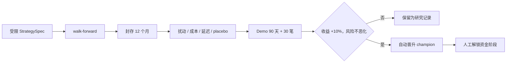

# 策略、GPT 持仓与自动晋升治理

## Champion 基线

每 15 分钟用已闭合 1h/4h K 线运行一次：

- 1h 的 24/72/168 小时时间序列动量三票；
- 4h 的 7/21 日 Donchian 突破两票；
- 五票等权，至少三票同向才生成 `TradeCandidate`；
- 30 日 1h EWMA 波动率决定基础数量；
- funding、基差、OI、ADL 和盘口恶化只能把数量乘以 `1 / 0.5 / 0`，不能独立产生方向；
- 交易池只含 USDT 本位永续，按点时 30 日成交额、上市天数、价差和 ±20 bps 深度筛选，并以 top-10/top-12 滞后减少换手。

该策略是可解释研究起点，不称为永久“最佳策略”。手续费、滑点、funding、深度冲击、部分成交和延迟都必须进入回测。

## GPT 审批与持仓规则

| 行为 | 必要条件 | GPT 权限上限 |
|---|---|---|
| `OPEN` | 未过期同向候选，置信度 ≥ 0.70 | 拒绝或缩小；不得反向/放大 |
| `ADD` | ≥ +1R、信号增强、置信度 ≥ 0.80、此前未加仓 | 仅一次，新增风险 ≤ 净值 0.25% |
| `HOLD` | 已有仓位和更新论点 | 不产生新订单 |
| `REDUCE` | 已有仓位 | 只能 `reduceOnly`，不得翻向 |
| `CLOSE` | 已有仓位 | 只能清理现有数量 |
| `REJECT` | 任意 | 不新增风险 |

初始风险为净值 0.75%，一次盈利加仓 0.25%，单仓总风险不超过 1%。初始止损距离使用 2×1h ATR(14)，数量由该距离反算。GPT 超时、配额不足、证据不足或 schema 无效时，`OPEN/ADD` 自动拒绝；模型不能阻止日亏损、回撤熔断或保护单退出。

每个 15 分钟周期、重大事件、funding 异常或失效条件触发都追加新的 `PositionThesis` 版本，旧版本不可覆盖。

## 学习闭环

“不断学习”不等于在线修改生产策略或让模型记忆账户。当前实现保存：

- 所有候选，包括 GPT 拒绝的候选；
- 1h/4h/24h 反事实净收益和决策后悔值；
- 每个结果的置信度校准误差；
- 权威成交、手续费、funding、滑点假设、持仓时长和 PnL/R；
- 模型、提示词、策略参数和执行版本。

来源可靠度聚合、删除/编辑事件的归因统计以及 MAE/MFE 仍是待实现的生产指标；在这些统计真正
落库并通过测试前，研究报告和晋升门不得声称已经使用它们。

每日研究归因错误；每周研究模型只能提出批准字段内的 `StrategySpec`，例如信号窗口、阈值、风险缩放和提示词版本。模型无权修改 Python、执行器、密钥处理或硬风控。

## Challenger 验收门槛

研究目标是扣除手续费、滑点和 funding 后的绝对收益最大化，同时全部满足：

1. 扩展窗口 walk-forward 且各折有最低交易数；
2. 封存的最后 12 个月不参与参数选择；
3. 参数 ±25% 扰动仍稳健；
4. 1/5/15 分钟延迟和 2×/3×成本压力；
5. 社交信号 placebo 不应产生虚假优势；
6. 最大回撤 ≤ 20%；
7. 2× 成本下净收益仍为正；
8. DSR 显著性概率 ≥ 0.95、PBO ≤ 10%；
9. 单一币种或月份收益贡献 ≤ 35%；
10. Demo 影子盘至少 90 天且 30 笔闭仓；
11. 相对 champion 净收益提高至少 10%，且回撤、尾部风险和集中度不恶化。

所有检验使用点时交易池，包含上市/退市、真实 filters、手续费层级、funding、spread、深度冲击、部分成交和牛/熊/震荡分段。失败项不得用主观理由覆盖。

### 外部证据与验证边界

场景成交和统计量不得由晋升验证器临时合成。受审计的外部点时模拟器负责生成完整场景矩阵，
独立统计任务负责 DSR/PBO，Demo 影子 runner 负责逐日覆盖和双方真实成交核算。交付物是严格 JSON，
由另一名操作员确认完整文件 SHA-256 后，通过 `research` Compose profile 导入。验证器不运行清单中的
代码或路径，只把每个结果绑定到策略/提示词版本、holdout seal、点时数据摘要、费用/slippage/funding
证据和统计请求摘要。任何缺项、未来日期、身份冲突或未经事实库确认的影子 evidence ID 都不能产生
可晋升记录。

影子成交的 fee、slippage、funding 必须分别引用三个互不相同的不可变
`external_evidence.evidence_record_id`。每条记录的 payload schema 固定为
`paired-shadow-cost-v1`，并包含 `cost_type`、`trade_id`、`episode_id`、`trace_id`、`symbol`、
`strategy_version`、`closed_at` 和 `amount`。三条记录必须逐字段绑定到同一笔清单成交，其中
`amount` 分别等于该成交的 fee、slippage 和 funding；审计行本身的 `trace_id`/`occurred_at` 也必须
与 payload 一致。该 `trace_id` 还必须已经存在于 external evidence 之外的不可变审计事实中，不能由
成本 payload 自行声明。旧式普通 external evidence、重复 ID、错配字段或不存在的 trace 均 fail closed，
不得写入 shadow journal 或晋升结果。

## 晋升与回滚

- 策略在当前资金阶段内可以自动晋升，但资金阶段绝不自动扩大。
- 每次晋升保存数据截止时间、参数、代码/提示词版本、完整指标、评估者和 champion 前版本。
- 对账错误、风险越界、明显漂移、来源合规问题或复现失败时，立即冻结新增风险并回滚上一 champion。
- 回滚只改变当前指针，不删除 challenger、订单、成交和决策历史。
- 若多次试验共享同一封存集，应重新封存数据，避免人工或模型逐步过拟合。

## 人工复核内容

人工不负责凭感觉替代样本外结果，而负责核验：数据授权与司法辖区、成本/流动性假设、指标实现、泄漏风险、异常收益集中、策略可解释性、密钥与部署隔离、退出可用性，以及资金阶段是否适合账户风险承受能力。
